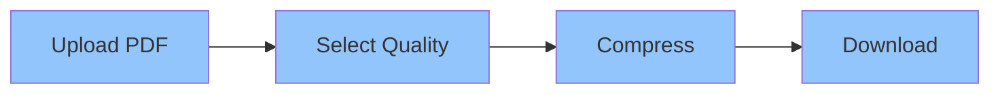
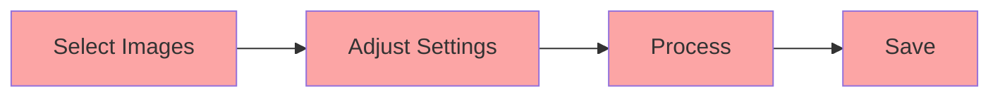

# 🎨 PixelPinch

<div align="center">


[](https://vercel.com/new/clone?repository-url=https%3A%2F%2Fgithub.com%2Fank920%2FPixelPinch)
[](https://opensource.org/licenses/MIT)
[](https://nodejs.org)
[](http://makeapullrequest.com)

> 🚀 A premium file compression tool with a beautiful UI and powerful features

[Demo](https://pixelpinch.vercel.app) · [Report Bug](https://github.com/ank920/PixelPinch/issues) · [Request Feature](https://github.com/ank920/PixelPinch/issues)

</div>

---

## ✨ Features

<div align="center">
<table>
<tr>
<td>

### 📄 PDF Compression
- Lossless compression using Ghostscript
- Multiple quality presets
- Maintains document integrity
- Support for all PDF versions

</td>
<td>

### 🖼️ Image Processing
- JPEG, PNG, WebP support
- Smart compression algorithms
- Batch processing
- Quality control slider

</td>
</tr>
<tr>
<td>

### ⚡ Performance
- Real-time compression
- Progress tracking
- Size comparison
- Instant preview

</td>
<td>

### 🎯 User Experience
- Drag & drop interface
- Dark theme
- Responsive design
- Smooth animations

</td>
</tr>
</table>
</div>

## 🎥 Demo & Screenshots

<div align="center">


| Dark Theme | Compression Results |
|------------|-------------------|
|  |  |

</div>

## 🛠️ Tech Stack

<div align="center">

| Frontend | Backend | Tools |
|----------|---------|-------|
|  |  |  |
|  |  |  |
|  |  |  |

</div>

## 🚀 Quick Start

### Prerequisites

```bash
# Check Node.js version
node --version  # Should be ≥ 14.0.0

# Install Ghostscript (macOS)
brew install ghostscript

# Install Ghostscript (Windows)
# Download from: https://ghostscript.com/releases/gsdnld.html
```

### Installation

1️⃣ Clone the repository
```bash
git clone https://github.com/ank920/PixelPinch.git
cd PixelPinch
```

2️⃣ Install dependencies
```bash
# Backend setup
cd backend
npm install

# Frontend setup
cd ../frontend
npm install
```

3️⃣ Environment setup
```bash
# Create .env in backend directory
echo "PORT=3001
NODE_ENV=development" > .env
```

4️⃣ Start development servers
```bash
# Terminal 1 - Backend
cd backend
npm run dev

# Terminal 2 - Frontend
cd frontend
npm start
```

## 🌟 Usage Examples

<div align="center">

### PDF Compression


### Image Compression


</div>

## 📦 Deployment

### Deploy on Vercel

1. Click the "Deploy with Vercel" button above
2. Configure your deployment settings:
   ```env
   NODE_ENV=production
   CORS_ORIGIN=your-frontend-url
   ```
3. Deploy and enjoy! 🎉

## 🤝 Contributing

Contributions make the open-source community amazing! Any contributions you make are **greatly appreciated**.

1. Fork the Project
2. Create your Feature Branch (`git checkout -b feature/AmazingFeature`)
3. Commit your Changes (`git commit -m 'Add some AmazingFeature'`)
4. Push to the Branch (`git push origin feature/AmazingFeature`)
5. Open a Pull Request

## 📝 License

Distributed under the MIT License. See `LICENSE` for more information.

## 🙏 Acknowledgments

- [Ghostscript](https://www.ghostscript.com/)
- [Sharp](https://sharp.pixelplumbing.com/)
- [Material-UI](https://mui.com/)
- [Framer Motion](https://www.framer.com/motion/)

---

<div align="center">

Made with ❤️ by [ank920](https://github.com/ank920)

⭐️ Star this project if you find it helpful!

</div> 